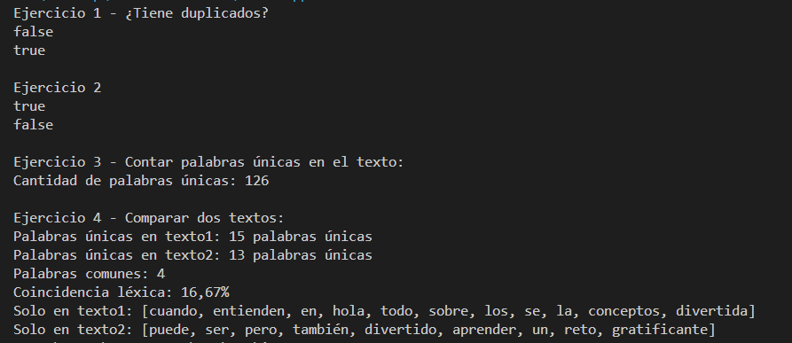

---

# 🧾 Informe de Práctica: Uso de Colecciones `Set` en Java

## ✅ Objetivo

El objetivo de esta práctica es comprender y comparar el funcionamiento de distintas implementaciones de la interfaz `Set` en Java (`HashSet`, `LinkedHashSet`, `TreeSet`) a través de la manipulación de cadenas, observando cómo afectan el orden, la unicidad y los criterios de comparación personalizados.

---

## 📁 Estructura del Proyecto

| Archivo         | Función principal |
|----------------|-------------------|
| `App.java`     | Ejecuta y muestra los resultados de distintos tipos de `Set` mediante llamadas a métodos de la clase `sets`. |
| `sets.java`    | Contiene métodos que construyen colecciones `Set` con diferentes comportamientos y comparadores. |

---

## 🧠 Conceptos Aplicados

### 🔹 `HashSet`
- No garantiza orden alguno.
- Alta eficiencia para inserciones y búsquedas.
- Elimina duplicados automáticamente.

### 🔹 `LinkedHashSet`
- Mantiene el **orden de inserción**.
- Útil cuando se quiere conservar el orden original sin duplicados.

### 🔹 `TreeSet`
- Ordena los elementos **automáticamente** usando el orden natural o un comparador.
- No permite duplicados y tiene rendimiento logarítmico (`O(log n)`).

### 🔹 Comparadores personalizados (`Comparator`)
- Permiten cambiar el criterio de orden en un `TreeSet`.
- Se implementan sobrescribiendo `compare()`.

---

## 🛠️ Descripción de los Métodos (`sets.java`)

| Método                                 | Descripción |
|----------------------------------------|-------------|
| `construirHashSet()`                   | Devuelve un `HashSet` con palabras sin duplicados, sin orden garantizado. |
| `construirLinkedHashset()`            | Devuelve un `LinkedHashSet` que respeta el orden de inserción. |
| `construirTreeSet()`                   | Devuelve un `TreeSet` que ordena alfabéticamente las palabras. |
| `construirTreeSetConComparador()`      | Usa un comparador que ordena por longitud ascendente y, si hay empate, alfabéticamente. |
| `construirTreeSetConComparador2()`     | Ordena por longitud descendente y, si hay empate, alfabéticamente en orden inverso. Ideal para ver el efecto de cambiar el comparador. |

---

## 🧪 Salida esperada en consola

Cada método imprime las palabras procesadas, en bloques como estos:

```
--------Construyendo HashSet--------
Palabra 1 pera (HashSet)
Palabra 2 manzana (HashSet)
...

-------Construyendo TreeSet con Comparador------
Palabra 1 pera (TreeSet con Comparador)
Palabra 2 laptop (TreeSet con Comparador)
...
```

---

## 🖼️ Imagen de ejemplo

A continuación, se recomienda insertar una captura de pantalla donde se vea claramente la ejecución del programa desde la consola, mostrando cómo se ordenan las palabras en cada tipo de `Set`.

```
!(image.png)
Imagen de los ejercicios de la siguiente clase

```

---

